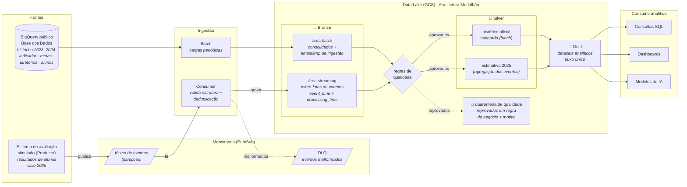
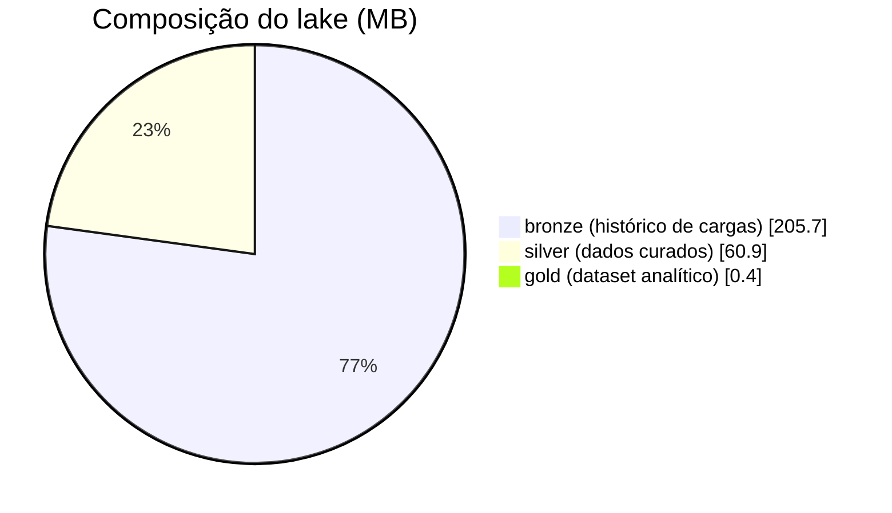
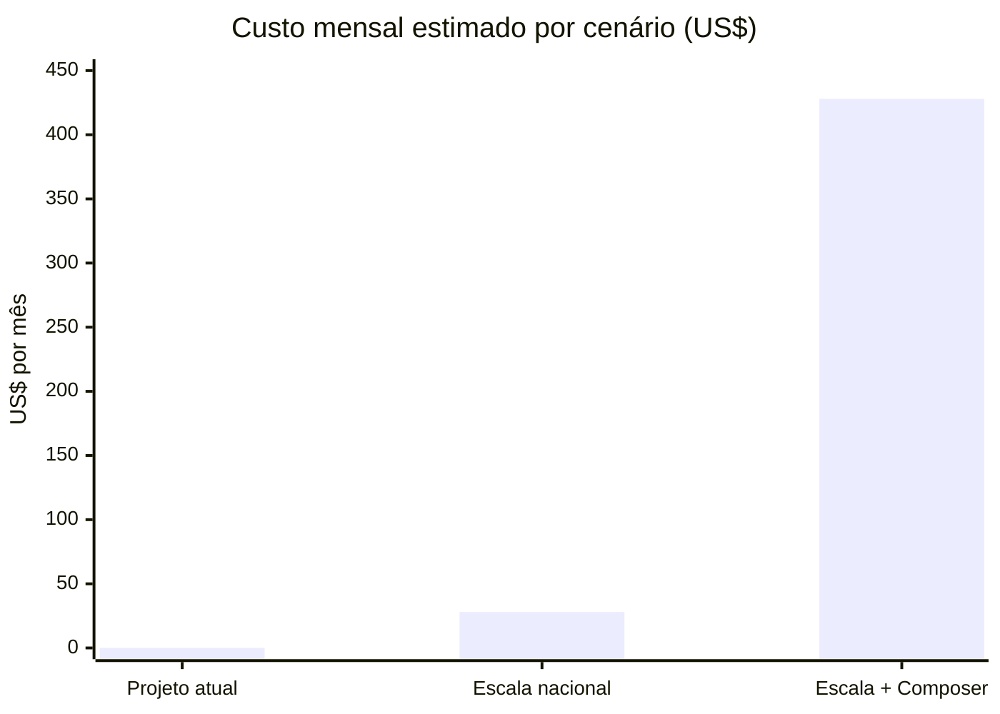

# Pipeline Híbrida para Análise da Alfabetização no Brasil

Pipeline híbrida de dados (batch e streaming) em nuvem para análise do **Indicador Criança Alfabetizada** (INEP / Base dos Dados), com Arquitetura Medalhão (Bronze, Silver e Gold), qualidade de dados, monitoramento e FinOps.

> Tech Challenge da Fase 2 (Data Prepare) · Pós-graduação IA para Devs · FIAP POS TECH

---

## Sumário

1. [Contexto do problema](#1-contexto-do-problema)
2. [Objetivo do projeto](#2-objetivo-do-projeto)
3. [Fonte de dados](#3-fonte-de-dados)
4. [Arquitetura da solução](#4-arquitetura-da-solução)
5. [Tecnologias utilizadas](#5-tecnologias-utilizadas)
6. [Decisões arquiteturais e trade-offs](#6-decisões-arquiteturais-e-trade-offs)
7. [Qualidade de dados](#7-qualidade-de-dados)
8. [Monitoramento e orquestração](#8-monitoramento-e-orquestração)
9. [FinOps e custos](#9-finops-e-custos)
10. [Aplicação em Inteligência Artificial](#10-aplicação-em-inteligência-artificial)
11. [Como executar](#11-como-executar)
12. [Estrutura do repositório](#12-estrutura-do-repositório)
13. [Status e roadmap](#13-status-e-roadmap)
14. [Referências](#14-referências)

---

## 1. Contexto do problema

A alfabetização na idade certa é um dos fundamentos do desenvolvimento educacional, social e econômico de um país. Crianças que não consolidam a leitura e a escrita no período adequado tendem a acumular defasagens ao longo de toda a trajetória escolar. Para enfrentar esse desafio, o Brasil instituiu o Compromisso Nacional Criança Alfabetizada, política que articula União, estados, Distrito Federal e municípios com o objetivo de garantir a alfabetização de todas as crianças até o final do 2º ano do ensino fundamental.

A relação entre educação e renda é bem documentada. Dados da PNAD Contínua com ano-base 2025 (IBGE, divulgação de 2026) indicam que trabalhadores com ensino superior completo recebem, em média, 3,6 vezes mais do que pessoas sem instrução. Estudo do Insper em parceria com a Fundação Roberto Marinho, publicado em 2020 e conduzido pelos economistas Ricardo Paes de Barros e Laura Machado, estimou em R$ 372 mil (valores de 2020) a perda total para o país por cada jovem que não conclui a educação básica, considerando renda, atividade econômica, saúde e violência ao longo da vida. Como mais de 500 mil jovens deixam de concluir a educação básica a cada ano, a perda estimada é de R$ 214 bilhões por coorte anual, o equivalente a cerca de 3% do PIB da época. No caso específico da alfabetização, relatório do Banco Mundial de 2022 estima que a geração de estudantes afetada pela pandemia pode deixar de obter US$ 21 trilhões em rendimentos ao longo da vida, em valor presente, em razão da chamada pobreza de aprendizagem, definida como a incapacidade de ler e compreender um texto simples aos 10 anos de idade.

Para acompanhar a política, foi criado o Indicador Criança Alfabetizada, que expressa o percentual de crianças do 2º ano consideradas alfabetizadas. A classificação de cada criança parte de avaliações aplicadas pelas redes estaduais de ensino, cujos resultados são equalizados pelo INEP na escala de proficiência do Saeb, o que permite a comparação entre estados e municípios. É considerada alfabetizada a criança que atinge ao menos 743 pontos nessa escala. Esse critério foi estabelecido pela Pesquisa Alfabetiza Brasil (INEP, 2023), na qual professores alfabetizadores de todo o país definiram as habilidades mínimas esperadas de uma criança alfabetizada, como ler e compreender textos curtos, localizar informações e escrever textos simples do cotidiano. Uma explicação detalhada do indicador e da sua metodologia está em [docs/sobre_o_indicador.md](docs/sobre_o_indicador.md).

Os resultados recentes mostram avanço. Na rede pública, a taxa passou de 55,9% em 2023 para 59,2% em 2024, valor 0,7 ponto percentual abaixo da meta pactuada para aquele ano (59,9%), e alcançou 66,0% em 2025, superando a meta de 64%. As metas pactuadas seguem em progressão até 80% em 2030 e convivem com a aspiração da política de alfabetizar a totalidade das crianças.

As médias nacionais, no entanto, encobrem desigualdades territoriais expressivas. Entre municípios e redes de ensino, as taxas de alfabetização variam de aproximadamente 2% a 100%. Compreender os fatores associados a essas diferenças exige a integração de dados que hoje se encontram em fontes distintas: o indicador por município e por UF, as metas pactuadas em cada esfera, os dados territoriais e os microdados de cerca de 4 milhões de alunos avaliados por ano. A qualidade e a atualização dessas informações condicionam a capacidade dos gestores públicos de priorizar ações e recursos.

## 2. Objetivo do projeto

O objetivo deste projeto é construir uma pipeline híbrida de dados em nuvem capaz de integrar, tratar e disponibilizar as fontes relacionadas ao Indicador Criança Alfabetizada, transformando dados públicos dispersos em uma base analítica única, confiável e auditável. A solução simula o trabalho de um time de engenharia de dados de uma organização pública de análise educacional, responsável por sustentar análises e decisões baseadas nesses dados.

A ingestão dos dados combina dois modos complementares. No modo batch, cargas periódicas trazem as bases consolidadas: o indicador por UF e por município, as metas pactuadas em cada esfera, os dados territoriais e os microdados de alunos. No modo streaming, eventos simulados reproduzem um cenário real do ciclo do indicador: a chegada de novas medições e atualizações de resultados, como as da edição de 2025, que ainda não constam nas bases públicas consolidadas. Essa combinação permite que a base analítica se mantenha atualizada sem depender exclusivamente de cargas completas.

A organização dos dados segue a Arquitetura Medalhão, em três camadas com níveis crescentes de refinamento. Na camada Bronze, os dados são preservados exatamente como chegam das fontes, garantindo histórico, auditoria e capacidade de reprocessamento. Na camada Silver, os dados são limpos, padronizados e validados, e as diferentes bases são integradas por meio de chaves comuns, como o código IBGE do município, a UF e o ano. Na camada Gold, os dados são modelados para consumo analítico, com visões como o indicador por município, a comparação entre metas e resultados e a evolução temporal da alfabetização.

Três disciplinas transversais sustentam a pipeline. Regras de qualidade de dados verificam duplicidades, valores ausentes, integridade das chaves de relacionamento e consistência entre tabelas, isolando registros inválidos em área de quarentena para auditoria. A observabilidade é embutida nos próprios scripts: relatórios de execução com volumetria e duração, reconciliação de contagens e códigos de saída que sinalizam falha para a orquestração (ver seção 8). Práticas de FinOps orientam as escolhas de armazenamento, processamento e consulta, buscando o menor custo operacional possível em nuvem sem comprometer a escalabilidade.

Ao final, a camada analítica permite responder perguntas relevantes para a gestão educacional, como quais municípios estão mais distantes das metas pactuadas, onde o indicador evolui mais lentamente e como os resultados se distribuem entre redes de ensino e territórios. A mesma base fica preparada para usos futuros em inteligência artificial, como modelos de predição de risco de não alfabetização por município e a identificação de perfis de vulnerabilidade educacional, apoiando políticas públicas baseadas em evidências.

## 3. Fonte de dados

Os dados são disponibilizados pela plataforma [Base dos Dados](https://basedosdados.org/dataset/073a39d4-89cf-4068-b1e8-34ed0d9c0b72?table=e1de7a6a-5038-4e81-89f0-a15f2cc12c9b), no dataset **Avaliação da Alfabetização** (organização INEP), hospedado no BigQuery público `basedosdados.br_inep_avaliacao_alfabetizacao`.

| Tabela | Conteúdo | Linhas | Cobertura |
|---|---|---:|---|
| `uf` | Indicador por UF, série e rede | 145 | 2023–2024 |
| `municipio` | Indicador por município, série e rede | 23.995 | 2023–2024 |
| `meta_alfabetizacao_brasil` | Taxa observada e metas 2024–2030 (Brasil) | 3 | 2023–2025 |
| `meta_alfabetizacao_uf` | Taxa observada e metas 2024–2030 por UF | 81 | 2023–2025 |
| `meta_alfabetizacao_municipio` | Taxa observada e metas 2024–2030 por município | 10.704 | 2023–2024 |
| `br_inep_avaliacao_alfabetizacao__alunos` | Microdados por aluno avaliado | 3.867.999 | 2023–2024 |
| `dicionario` | Dicionário de códigos das colunas categóricas | 27 | — |

A elas soma-se uma tabela de **dimensão** de outro dataset da mesma plataforma, incorporada quando a integração da camada Silver revelou que as tabelas do INEP carregam apenas códigos de município:

| Tabela | Conteúdo | Linhas | Fonte |
|---|---|---:|---|
| `diretorio_municipio` | Nome, UF e região por código IBGE de município | 5.571 | `basedosdados.br_bd_diretorios_brasil.municipio` |

Antes de qualquer decisão de arquitetura, foi realizado um levantamento das fontes por meio do script [notebooks/levantamento_fontes_dados.py](notebooks/levantamento_fontes_dados.py), que investiga schemas, volumes, cobertura temporal, chaves de relacionamento e integridade das tabelas. Não se trata de uma análise exploratória dos dados (EDA), mas de um trabalho de reconhecimento das fontes cujo objetivo é amparar as decisões sobre a arquitetura da solução e as tecnologias utilizadas, registradas em [docs/decisoes.md](docs/decisoes.md). Os resultados completos do levantamento estão documentados em [docs/dicionario_dados.md](docs/dicionario_dados.md).

## 4. Arquitetura da solução

### 4.1 Classificação das fontes: batch e streaming

A definição do modo de ingestão de cada fonte parte de um critério simples: a dinâmica natural de produção do dado. Fontes cadastrais e pactuadas mudam raramente e são publicadas de forma consolidada; já os resultados de avaliação nascem de forma contínua, à medida que as provas são aplicadas e processadas pelas redes estaduais.

| Fonte | Natureza | Dinâmica de produção | Modo de ingestão |
|---|---|---|---|
| Diretório de municípios (IBGE) | Cadastro | Quase imutável | Batch |
| Metas de alfabetização (Brasil, UF, município) | Pacto entre entes federativos | Definidas uma vez, revisões raras | Batch |
| Indicador consolidado (`uf`, `municipio`) | Dado derivado (agregação) | Publicado uma vez ao ano | Batch (carga histórica) |
| Microdados de alunos | Fonte primária | Cada avaliação processada gera um resultado novo | Streaming (simulado) |

A relação entre as tabelas consolidadas e os microdados foi verificada empiricamente durante o levantamento das fontes. Recalculando a taxa municipal a partir dos alunos, com o peso amostral, 95,8% das combinações de município, ano e rede coincidem com o valor oficial em até 0,05 ponto percentual, o que indica que essas tabelas se comportam majoritariamente como agregações dos microdados. A relação, porém, não é completa: em 2023, 643 municípios constam no consolidado sem nenhum registro correspondente nos microdados públicos, além de divergências residuais de valor em cerca de 4% dos casos. Isso mostra que o cálculo oficial do INEP parte de uma base própria, mais completa que a disponibilizada publicamente (detalhes em [docs/sobre_o_indicador.md](docs/sobre_o_indicador.md)).

Por esse motivo, a pipeline utiliza sempre o dado da fonte oficial nas visões consolidadas: o histórico do indicador, ingerido por batch, permanece exatamente como publicado pelo INEP, sem substituição por valores derivados. A agregação calculada a partir dos eventos de alunos existe apenas onde ainda não há dado oficial, como visão preliminar do ciclo de 2025, claramente identificada como estimativa e destinada a ser substituída pelos valores oficiais quando publicados. A possibilidade de derivar as agregações diretamente dos microdados, dispensando parte das ingestões consolidadas, fica registrada como discussão futura de potencial economia no [diário de decisões](docs/decisoes.md). Ingerir as demais fontes por streaming adicionaria complexidade e custo sem benefício, uma vez que sua atualização é, por natureza, esporádica e consolidada.

### 4.2 Organização em camadas: código no repositório, dados no data lake

O repositório versiona exclusivamente código e documentação. Os dados residem em um data lake no Google Cloud Storage, organizado segundo a Arquitetura Medalhão:

```
gs://<bucket-do-projeto>/
├── bronze/                  # dados brutos, como chegaram das fontes
│   ├── uf/  municipio/  meta_*/  alunos/  dicionario/  diretorio_municipio/   (cargas batch)
│   └── eventos_resultado_aluno/                                               (micro-lotes do streaming)
├── silver/                  # dados limpos, padronizados, integrados e validados
│   └── alunos/  municipio/  estimativa_2025/  metas_brasil/  metas_uf/  metas_municipio/
├── gold/                    # datasets analíticos prontos para consumo
├── quarentena/              # registros reprovados nas regras de qualidade, com o motivo
└── controle/                # estado operacional (deduplicação do streaming)
```

Cada módulo de `src/` escreve em uma camada: `src/ingestion` alimenta a Bronze e `src/transform` produz Silver e Gold, executando as regras de qualidade na passagem entre camadas e alimentando a quarentena. Os arquivos são gravados em formato Parquet, colunar e comprimido, com particionamento por data de ingestão na Bronze e por data de processamento na Silver, o que reduz armazenamento e custo de leitura e preserva o histórico de cargas.

### 4.3 Fluxo de dados

1. **Ingestão batch:** consultas ao BigQuery público da Base dos Dados extraem as fontes consolidadas e as gravam na camada Bronze, com metadados de ingestão (timestamp e origem). O papel do batch não se limita ao histórico de 2023 e 2024: toda publicação consolidada futura, como o resultado oficial de 2025 quando divulgado pelo INEP, entra pela mesma carga;
2. **Ingestão streaming:** um producer, que representa o sistema externo de avaliação, publica no tópico os resultados individuais do ciclo de 2025; o producer não conhece o destino dos eventos. Um consumer, componente da pipeline, lê o tópico, valida a estrutura dos eventos, descarta duplicatas e grava micro-lotes na Bronze. Eventos estruturalmente inválidos (campo ausente, tipo errado) são desviados pelo consumer para uma Dead Letter Queue (DLQ), sem bloquear o fluxo. A DLQ não se confunde com a quarentena de qualidade: a DLQ recebe o que não pôde ser lido, na ingestão; a quarentena recebe o que foi lido mas reprovou em regra de negócio, na transformação. Essa separação de papéis é o desacoplamento característico do padrão publish/subscribe;
3. **Transformação:** os dados da Bronze são limpos, padronizados e integrados na Silver; os eventos de alunos são agregados para compor a estimativa preliminar do indicador de 2025;
4. **Qualidade:** as regras de validação são executadas na passagem para a Silver; registros reprovados são isolados na quarentena com o motivo da reprovação;
5. **Consumo analítico:** a camada Gold materializa os datasets analíticos, publicados para consulta SQL, dashboards e modelos.

Os dois modos de ingestão compartilham as mesmas camadas do medalhão: batch e streaming gravam em áreas distintas da mesma Bronze e convergem na Silver, onde o histórico consolidado e a estimativa do ciclo corrente são integrados. Da Silver em diante, o fluxo é único.

### 4.4 Diagrama da pipeline



O diagrama representa a **visão de componentes** da pipeline: quais peças existem e como se conectam. Ele não especifica o conteúdo que trafega em cada conexão. Duas evoluções previstas completarão essa lacuna: os nomes dos serviços de mensageria e de processamento serão adicionados quando essas escolhas forem tomadas, e a **visão do fluxo do dado** (o payload dos eventos, seus campos e transformações a cada passo) será documentada na etapa de streaming, quando o contrato do evento for definido. Ambas constam na tabela de decisões pendentes do [diário de decisões](docs/decisoes.md).

### 4.5 Componentes e serviços

| Função na arquitetura | Serviço | Situação |
|---|---|---|
| Fonte de extração | BigQuery público (Base dos Dados) | definido (D-002) |
| Data lake (camadas do medalhão) | Google Cloud Storage | definido (D-006) |
| Mensageria do streaming (tópico e DLQ) | Google Pub/Sub | definido (D-009) |
| Motor de processamento da Silver | pandas, lendo e gravando Parquet no lake | definido (D-012) |
| Orquestração | não adotada nesta fase; execução sequencial documentada | decidido (D-014, ver seção 8) |

As justificativas de cada escolha estão no [diário de decisões](docs/decisoes.md). O contrato dos eventos de streaming está em [config/schemas/evento_resultado_aluno.md](config/schemas/evento_resultado_aluno.md).

## 5. Tecnologias utilizadas

| Tecnologia | Papel | Justificativa |
|---|---|---|
| Google Cloud Platform (GCP) | Nuvem do projeto | A fonte de dados é distribuída via BigQuery público da Base dos Dados, o que elimina movimentação inicial de dados; o free tier cobre o volume do projeto |
| BigQuery | Fonte de extração e camada de consumo | Acesso SQL direto às tabelas públicas na extração; no consumo, tabela externa sobre a Gold (o dado permanece no lake, sem duplicação); consultas dentro do free tier de 1 TB/mês |
| Python | Linguagem da pipeline | Ecossistema consolidado de engenharia de dados; bibliotecas `pandas-gbq` e `google-cloud-bigquery` |
| Google Cloud Storage | Data lake (Bronze, Silver, Gold e quarentena) | Object storage durável e de baixo custo; free tier de 5 GB/mês cobre o volume do projeto; mesma região da fonte evita custo de transferência |
| Parquet | Formato de armazenamento das camadas | Colunar e comprimido; na tabela de alunos ficou 3,0 vezes menor que o equivalente em CSV (medição do projeto) |
| Google Pub/Sub | Mensageria do streaming | Serviço gerenciado no mesmo projeto GCP; dead letter topic nativo; conceitos equivalentes aos estudados nas aulas de Kafka (ver D-009) |
| pandas | Motor de transformação (Bronze → Silver → Gold) | O volume do projeto (~70 MB de Bronze) está muito abaixo do que justificaria processamento distribuído; dimensionar a ferramenta ao problema é prática de FinOps (ver D-012) |

A escolha restante (orquestração) será definida e justificada na etapa correspondente.

## 6. Decisões arquiteturais e trade-offs

Todas as decisões do projeto estão registradas com data, contexto, justificativa e alternativas no [diário de decisões](docs/decisoes.md) (D-001 a D-013). Esta seção consolida os quatro trade-offs estruturais, aqueles em que a alternativa descartada era legítima e a escolha define a arquitetura.

### 6.1 Data lake × data warehouse

| Arquitetura escolhida | Alternativa considerada |
|---|---|
| Python extrai do BigQuery para Parquet no lake (GCS); as camadas do medalhão são arquivos; a Gold é publicada de volta ao BigQuery para consulta | Tudo dentro do BigQuery: queries salvas e agendadas transformando as tabelas da fonte em datasets próprios (ELT dentro do warehouse) |

Quatro fundamentos sustentam a escolha:

1. **Pipeline como código:** queries salvas no console vivem fora do repositório, sem commit, sem PR, sem diff e sem histórico de quem mudou o quê. Código Python, com o SQL embutido, é integralmente versionado, e cada mudança na pipeline passa por revisão;
2. **Reprodutibilidade:** quem clona o repositório reconstrói a pipeline do zero no próprio projeto GCP. Queries salvas no console de um projeto pessoal não são inspecionáveis nem reproduzíveis pelo avaliador;
3. **Bronze física, não virtual:** uma view reflete o estado atual da fonte; se a origem corrigir um número, a "bronze virtual" muda junto e a auditoria se perde. O Parquet no lake congela o dado como ele chegou, com o timestamp de ingestão;
4. **Streaming exige código:** producer, consumer, DLQ e deduplicação não se fazem com query. Como o código é obrigatório para metade da ingestão, concentrar a pipeline nele mantém um paradigma único.

**Contraponto honesto:** o dbt resolve o versionamento para o mundo "tudo no warehouse" (SQL em Git, com testes e PRs), e uma operação puramente batch poderia legitimamente escolher BigQuery com dbt. Não foi a escolha aqui porque o case exige medalhão em lake e ingestão streaming, e porque a Bronze física se perderia. O warehouse é usado onde se pode servir de análise (tabela externa sobre a Gold, decisão D-012), não hospedar a pipeline inteira.

### 6.2 Batch × streaming

O critério de classificação foi a dinâmica natural de produção de cada dado (decisão D-005, detalhada na seção 4.1): cadastros e metas nascem consolidados e mudam raramente (batch); resultados de avaliação nascem continuamente durante o ciclo de aplicação (streaming, simulado no nível do aluno). O trade-off real estava em *quanto* colocar no fluxo: simular também os consolidados como eventos exercitaria mais a mensageria, mas descolaria da realidade (indicadores consolidados são publicados em lote) e reduziria a pipeline a substituir valores em vez de calcular agregação em fluxo. A regra de convivência entre os modos foi verificada empiricamente antes de virar arquitetura: o consolidado oficial é sempre a fonte de verdade (95,8% das taxas municipais são reproduzíveis dos microdados, mas 643 municípios de 2023 não têm microdados públicos), e a agregação do fluxo vale apenas onde ainda não existe publicação, identificada pela coluna de origem.

### 6.3 Kafka × Pub/Sub

O módulo ensinou streaming com Apache Kafka; a pipeline usa Google Pub/Sub (decisão D-009). Os conceitos transferem-se um a um: producer e publisher, consumer group e subscription, offset e ack, partição com chave e ordering key, retenção e backlog. A escolha ficou com o serviço gerenciado da mesma nuvem: mesma credencial, mesmo console, dead letter topic nativo e free tier folgado, mantendo a arquitetura inteira em um único provedor (coerência com a D-001). **Contraponto:** o Kafka local seria fiel à ferramenta das aulas e exporia a mecânica de partições e offsets com mais detalhe, ao custo de um broker fora da nuvem do projeto, com instalação e administração próprias. O professor confirmou a flexibilidade de tecnologia para ingestões equivalentes no grupo do Discord da Pós Tech.

### 6.4 pandas × Spark (custo × performance)

O volume do projeto (cerca de 70 MB de Bronze, 3,9 milhões de linhas na maior tabela) está ordens de grandeza abaixo do que justifica processamento distribuído: dimensionar a ferramenta ao problema é a prática de FinOps que a própria disciplina recomenda contra o excesso de engenharia (decisão D-012). O pandas lê e grava `gs://` nativamente, já estava validado nas ingestões e preserva o medalhão como três áreas do mesmo bucket. O formato Parquet entrega a eficiência de armazenamento medida no projeto (tabela de alunos 3,0 vezes menor que o equivalente CSV). **Caminho de escala declarado:** se o volume crescer em ordem de grandeza (novas edições anuais mudam pouco; a inclusão de outras avaliações mudaria o cenário), as funções de transformação migram para Spark em Dataproc sem alteração do desenho das camadas, porque a fronteira entre elas é o formato dos arquivos, não o motor.

## 7. Qualidade de dados

A qualidade é tratada em três tribunais distintos, cada um no ponto da pipeline onde o problema pode ser detectado:

| Situação | Onde é detectada | Destino |
|---|---|---|
| Evento malformado ou duplicado no fluxo | Ingestão streaming (validação do contrato) | DLQ / descarte com registro |
| Violação estrutural (aluno presente sem nota; ausente com nota) | Transformação Bronze → Silver | Quarentena, com o motivo carimbado |
| Nulo com significado (ausente sem proficiência; resultado sem meta pactuada) | Transformação Bronze → Silver | Permanece na Silver, com semântica documentada |

Princípios adotados (decisões D-011 e D-013):

- **Nada é apagado.** O registro reprovado é isolado em `quarentena/` com o motivo da reprovação, mantendo a pipeline auditável (é possível responder por que um aluno não está na Silver) e reprocessável (se a regra mudar, a quarentena é a fila de reavaliação);
- **Nulos são tratados de forma condicional.** Proficiência e peso nulos são legítimos em alunos ausentes (nulo estrutural da fonte) e anômalos em presentes; a Silver preserva os ausentes com a flag `presente` e envia as anomalias à quarentena. Na execução da carga histórica, 1.185 registros (0,03% dos 3,9 milhões) foram quarentenados por presença sem nota;
- **Toda regra nasce de verificação empírica.** As premissas foram validadas nos dados antes de virarem código (notebook `desenv_03`, Seções 4 e 7), e as verificações estruturais (joins sem alteração de contagem, conservação de linhas, reconciliação de gravação) derrubam a execução de produção com código de saída 1;
- **Integridade referencial conferida a cada join:** contagem de linhas inalterada (join muitos-para-um não cria nem elimina linhas) e correspondência completa das chaves (zero municípios sem par no diretório).

## 8. Monitoramento e orquestração

**Decisão de escopo (D-014):** o monitoramento formal e a ferramenta de orquestração não foram implementados nesta fase. O monitoramento é item opcional no enunciado, e o autor optou por não o desenvolver por questão de escopo e simplificação na resolução do Tech Challenge; a orquestração acompanhou a decisão, porque o encadeamento da pipeline (passos 4 a 8 do Como Executar) tem quatro nós em sequência e execução manual documentada. As alternativas avaliadas e o racional completo estão no [diário de decisões](docs/decisoes.md).

A decisão foi possível porque a observabilidade básica está **embutida nos próprios scripts**, construída ao longo das etapas:

| Mecanismo | Onde | O que revela |
|---|---|---|
| Relatório de execução (`RESUMO DA EXECUCAO`) | todos os `prod_` | linhas processadas, volume, duração por etapa, partição da carga e status final |
| Reconciliação de contagens | ingestão e gravações (`prod_01`, `prod_03`, `prod_04`) | divergência entre o que saiu da fonte/memória e o que está no lake |
| Códigos de saída 0/1 | todos os `prod_` | contrato de falha pronto para qualquer orquestrador consumir |
| DLQ com motivo | consumer do streaming (`prod_02`) | eventos malformados, sem interrupção do fluxo |
| Deduplicação persistida | `controle/` no bucket | reprocessamentos e duplicatas entre execuções |
| Quarentena com motivo | `quarentena/` no lake | registros reprovados nas regras de qualidade, auditáveis |

**Caminho de evolução declarado:** com mais fontes ou janelas de dependência complexas, o encadeamento migra para um orquestrador (Cloud Composer/Airflow, o mapeamento da GCP visto em aula), consumindo os códigos de saída já existentes; o monitoramento formal adicionaria alertas, acompanhamento de backlog e lag do Pub/Sub e painéis de volumetria por camada. Nenhum script precisaria mudar.

## 9. FinOps e custos

### 9.1 Práticas aplicadas

Cada prática abaixo está implementada e tem evidência medida no projeto:

- **Formato colunar comprimido:** todas as camadas em Parquet; na tabela de alunos, 3,0 vezes menor que o equivalente CSV (medição do projeto, `desenv_01`);
- **Leitura colunar e seletiva:** as transformações leem apenas as colunas necessárias (`columns=` no pandas), e contagens de conferência trafegam uma única coluna;
- **Particionamento por data com leitura da partição mais recente:** consultas e transformações nunca varrem o histórico de cargas;
- **Separação entre computação e armazenamento, com computação zero em repouso:** não há cluster, VM, broker nem orquestrador ligados; entre execuções, o único custo da arquitetura é o armazenamento no bucket (decisões D-012 e D-014);
- **Consumo sem duplicação:** o BigQuery consulta a Gold por tabela externa; o dado existe uma única vez, no lake;
- **Mesma região para fonte, lake e consumo** (`us-central1`): sem custo de transferência entre serviços;
- **Controle de recursos por executor:** cada pessoa roda no próprio projeto GCP e bucket (`config.json`), com o quota project declarado; o billing é individual e não há recurso compartilhado.

### 9.2 Volume real medido

Medição direta do bucket após a carga completa das três camadas (jul/2026):

| Área | Volume | Observação |
|---|---:|---|
| `bronze/` | 205,7 MB | acumula o histórico de partições (3 cargas de ~68 MB) |
| `silver/` | 60,9 MB | curadoria com colunas selecionadas |
| `gold/` | 0,4 MB | o dataset analítico completo |
| `quarentena/` + `controle/` | < 0,1 MB | auditoria e estado operacional |
| **Total** | **267 MB** | ~5% do free tier do Cloud Storage |



A Bronze domina o volume porque preserva o histórico de cargas por partição de data, que é seu papel. A alavanca de custo declarada para o crescimento é a **política de ciclo de vida** do bucket: regras de lifecycle podem mover partições antigas para classes frias (Nearline/Coldline, frações do preço) ou expirá-las após o período de auditoria, sem tocar no código da pipeline.

### 9.3 Estimativa de custo em dois cenários

Valores de referência da tabela pública da GCP em jul/2026, arredondados; a estimativa fina se faz na [calculadora oficial](https://cloud.google.com/products/calculator).

**Cenário 1, o projeto como está** (carga completa mensal + consultas de análise):

| Serviço | Uso mensal | Free tier | Custo |
|---|---|---|---:|
| Cloud Storage | 0,27 GB armazenados | 5 GB | US$ 0 |
| BigQuery (consultas) | dezenas de GB varridos (extração da fonte + consultas na Gold) | 1 TB | US$ 0 |
| BigQuery (armazenamento) | zero (tabela externa) | — | US$ 0 |
| Pub/Sub | < 0,01 GB de tráfego | 10 GB | US$ 0 |
| **Total** | | | **US$ 0,00** |

A arquitetura opera integralmente dentro dos free tiers, com folga de mais de uma ordem de grandeza em cada serviço.

**Cenário 2, escala de operação nacional contínua** (hipótese: todas as edições históricas mais enriquecimento externo, ~15 GB de lake; streaming com os ~4 milhões de resultados do ciclo fluindo como eventos; consultas analíticas diárias de uma equipe, ~3 TB varridos/mês):

| Serviço | Uso mensal | Custo aproximado |
|---|---|---:|
| Cloud Storage | 15 GB | ~US$ 0,30 |
| BigQuery (consultas) | 3 TB varridos (2 TB além do free tier) | ~US$ 12,50 |
| Pub/Sub | ~20 GB de tráfego | ~US$ 0,40 |
| Dataproc (se a transformação migrar para Spark, cluster efêmero ~1 h/dia) | ~30 h | ~US$ 15 |
| **Total sem orquestrador gerenciado** | | **~US$ 28** |
| Cloud Composer (se adotado) | ambiente mínimo sempre ligado | **+ ~US$ 400** |



A leitura que importa está no salto da terceira barra: mesmo no cenário de escala, **o custo de dados é marginal**; quem domina a conta é o serviço gerenciado sempre ligado (orquestração). É a confirmação numérica das decisões D-012 e D-014: dimensionar a ferramenta ao problema é onde o FinOps se ganha ou se perde nesta arquitetura.

## 10. Aplicação em Inteligência Artificial

A camada Gold foi desenhada para alimentar modelos, não apenas dashboards: a tabela `gold.indicador_municipio` reúne, por município e ano, a taxa nas três medidas da D-011, a participação, a meta vigente e a distância até ela, com a origem de cada ponto declarada. Três aplicações diretas:

- **Predição de risco de não atingimento:** com a série histórica municipal, um modelo supervisionado pode estimar a probabilidade de cada município não atingir a meta do ciclo seguinte, antecipando a priorização de apoio. As variáveis candidatas já estão na Gold: trajetória da taxa, participação, porte da rede (alunos presentes), UF e região. A depender da necessidade e da complexidade do modelo, features adicionais de domínio público podem ser incorporadas: o IDHM por município (Atlas do Desenvolvimento Humano, PNUD), o PIB per capita municipal (IBGE), os indicadores de infraestrutura escolar e de formação docente do Censo Escolar (INEP), a taxa de distorção idade-série e o recorte socioeconômico do Censo Demográfico (saneamento, escolaridade dos responsáveis). Boa parte dessas bases está na própria Base dos Dados, chaveada pelo mesmo `id_municipio` do diretório: cada uma entraria pela ingestão batch e percorreria as camadas como qualquer fonte nova, sem mudança no desenho da pipeline;
- **Priorização com incerteza declarada:** a distância entre `taxa` e `taxa_ajustada` cresce onde a participação é baixa e funciona como medida de incerteza da própria medição. Ela separa dois problemas de natureza distinta: município distante da meta com participação alta (problema de aprendizagem) e com participação baixa (problema de medição antes de tudo). O ranking de 2024 já revelou um padrão concreto para investigação: municípios pequenos do Rio Grande do Sul, com meta pactuada de 80% e participação alta, dezenas de pontos abaixo do pactuado;
- **Alerta precoce em fluxo:** a estimativa do ciclo corrente, recalculada a cada consumo do streaming, permite acompanhar o indicador durante o ano de aplicação, em vez de esperar a publicação oficial, sempre identificada como estimativa (D-005) e acompanhada do volume amostral que a sustenta.

Nenhuma dessas aplicações exige mudança na pipeline: todas consomem a Gold pelo BigQuery, como qualquer ferramenta de análise.

## 11. Como executar

Pré-requisitos: Python 3.11 ou superior e uma conta Google.

> 📌 **Nota para Windows:** se o comando `python` não for reconhecido no seu terminal (o instalador nem sempre o adiciona ao PATH do PowerShell), substitua-o pelo launcher `py`, que é instalado por padrão: `py src/ingestion/prod_01_ingestao_batch.py`. Os comandos abaixo usam a forma canônica `python`.

**Duas formas de percorrer a pipeline.** Depois da configuração (passos 1 a 3), o executor escolhe a trilha:

- **Pelos notebooks de desenvolvimento** (`notebooks/desenv_01` a `desenv_04`): execução célula a célula, com a documentação de cada passo, os conceitos das aulas e as conferências intermediárias visíveis. É o caminho recomendado para quem quer entender a estrutura e a lógica de cada camada, com a vantagem de depurar no detalhe: qualquer célula pode ser reexecutada e seu resultado inspecionado isoladamente antes de seguir;
- **Pelos scripts de produção** (`src/`, prefixo `prod_`): a mesma lógica já validada, empacotada em funções, com relatório de execução e código de saída para orquestração. É a via direta, usada nos passos 4 a 8 abaixo; se o terminal acusar comando não reconhecido, vale a nota acima sobre o launcher `py`.

As duas trilhas produzem o mesmo resultado no lake (a correspondência entre os pares está na seção 12); os notebooks guardam, além do código, as evidências de execução que fundamentaram cada decisão.

1. **Crie um projeto no Google Cloud** (gratuito, sem cartão): <https://console.cloud.google.com/projectcreate>. Anote o ID do projeto;
2. **Instale as dependências:**
   ```
   pip install -r requirements.txt
   ```
3. **Configure o projeto:** copie `config/config.example.json` para `config/config.json` e preencha com o ID do seu projeto GCP e um nome de bucket próprio (nomes de bucket são únicos globalmente);
4. **Execute a ingestão batch:**
   ```
   python src/ingestion/prod_01_ingestao_batch.py
   ```
   ou, se não funcionar no terminal, tente via launcher py:
   ```
   py src/ingestion/prod_01_ingestao_batch.py
   ```
   
   Na primeira execução, o navegador abrirá solicitando a autorização da sua conta Google (BigQuery e Cloud Storage). O bucket do data lake é criado automaticamente caso não exista. A carga completa das 7 tabelas leva alguns minutos (a tabela `alunos` tem 3,9 milhões de linhas);
5. **Verificação manual:** acesse `https://console.cloud.google.com/storage/browser/<SEU_BUCKET>` e confira a árvore `bronze/<tabela>/data_ingestao=<data>/`. O relatório impresso pelo script mostra as contagens e a reconciliação com a fonte.

6. **Execute a ingestão streaming** (dois terminais ou em sequência):
   ```
   python src/ingestion/prod_02_ingestao_streaming.py publicar --eventos 200
   python src/ingestion/prod_02_ingestao_streaming.py consumir
   ```
   ou
   ```
   py src/ingestion/prod_02_ingestao_streaming.py publicar --eventos 200
   py src/ingestion/prod_02_ingestao_streaming.py consumir
   ```
   O modo `publicar` simula o sistema externo de avaliação emitindo resultados do ciclo de 2025; o modo `consumir` lê o backlog, valida contra o contrato, desvia malformados para a DLQ, descarta duplicatas (registro persistido em `controle/` no bucket) e grava o micro-lote em `bronze/eventos_resultado_aluno/`. A infraestrutura de mensageria (tópicos e subscriptions) é criada automaticamente na primeira execução.

7. **Execute a transformação Bronze → Silver:**
   ```
   python src/transform/prod_03_bronze_to_silver.py
   ```
   ou
   ```
   py src/transform/prod_03_bronze_to_silver.py
   ```
   O script decodifica os dados com o dicionário da fonte, converte as metas para o formato long, aplica a flag de presença aos alunos, integra os resultados municipais com o diretório IBGE e a meta da safra vigente, agrega os eventos do fluxo na estimativa preliminar de 2025, executa as regras de qualidade (reprovados vão para `quarentena/`) e grava as tabelas em `silver/`, reconciliando cada gravação. A verificação manual é a mesma do passo 5: as áreas `silver/` e `quarentena/` devem aparecer no bucket ao lado de `bronze/`.

8. **Execute a transformação Silver → Gold:**
   ```
   python src/transform/prod_04_silver_to_gold.py
   ```
   ou
   ```
   py src/transform/prod_04_silver_to_gold.py
   ```
   O script calcula as três medidas da D-011 (taxa oficial, taxa ajustada e participação), monta a série histórica municipal unindo o histórico oficial com a estimativa do fluxo (coluna `origem` em cada linha), integra a meta da safra vigente, grava `gold/indicador_municipio` e publica a tabela no BigQuery como tabela externa. Verificação manual: no console do BigQuery, o dataset `gold` aparece no seu projeto com a tabela `indicador_municipio`, consultável em SQL; no bucket, a área `gold/` completa o medalhão.

A ordem dos passos 4 a 8 é o encadeamento da pipeline: cada script termina com código de saída 0 (sucesso) ou 1 (falha), e a execução deve parar na primeira falha (decisão D-014, seção 8).

## 12. Estrutura do repositório

```
├── src/                                   # código de produção (prefixo prod_)
│   ├── ingestion/
│   │   ├── prod_01_ingestao_batch.py         # ingestão batch → Bronze
│   │   └── prod_02_ingestao_streaming.py     # producer e consumer do streaming
│   └── transform/
│       ├── prod_03_bronze_to_silver.py       # Bronze → Silver, com qualidade e quarentena
│       └── prod_04_silver_to_gold.py         # Silver → Gold, com publicação no BigQuery
├── notebooks/                             # desenvolvimento e estudos (prefixo desenv_)
│   ├── desenv_00_levantamento_fontes_dados.py
│   ├── desenv_01_ingestao_batch.ipynb        # desenvolvimento da ingestão batch
│   ├── desenv_02_ingestao_streaming.ipynb    # desenvolvimento da ingestão streaming
│   ├── desenv_03_bronze_to_silver.ipynb      # desenvolvimento da camada Silver
│   └── desenv_04_silver_to_gold.ipynb        # desenvolvimento da camada Gold
├── docs/
│   ├── dicionario_dados.md
│   ├── sobre_o_indicador.md
│   └── decisoes.md
├── config/
│   ├── config.example.json                # modelo de configuração (versionado)
│   ├── config.json                        # configuração pessoal (não versionado)
│   └── schemas/
│       └── evento_resultado_aluno.md      # contrato do evento de streaming
└── requirements.txt
```

**Convenção de desenvolvimento e produção:** cada componente da pipeline é desenvolvido em um notebook (prefixo `desenv_`, em `notebooks/`), célula a célula, com os conceitos das aulas e as evidências de execução salvas. Quando validado, o código é promovido para um script de produção (prefixo `prod_`, em `src/`), que é a versão executada pela orquestração. Os pares compartilham o mesmo nome-base e referenciam um ao outro nos cabeçalhos.

| Desenvolvimento (`notebooks/`) | Produção (`src/`) | Etapa do roadmap |
|---|---|---|
| `desenv_00_levantamento_fontes_dados.py` | (sem par: levantamento de fontes) | 1 |
| `desenv_01_ingestao_batch.ipynb` | `ingestion/prod_01_ingestao_batch.py` | 3 |
| `desenv_02_ingestao_streaming.ipynb` | `ingestion/prod_02_ingestao_streaming.py` | 4 |
| `desenv_03_bronze_to_silver.ipynb` | `transform/prod_03_bronze_to_silver.py` | 5 |
| `desenv_04_silver_to_gold.ipynb` | `transform/prod_04_silver_to_gold.py` | 6 |

## 13. Status e roadmap

| Etapa | Descrição | Status |
|---|---|---|
| 0 | Fundação: repositório, estrutura, README inicial | ✅ concluída |
| 1 | Exploração dos dados e dicionário | ✅ concluída |
| 2 | Desenho da arquitetura, diagrama e trade-offs | 🟡 em andamento |
| 3 | Ingestão batch (camada Bronze) | ✅ concluída |
| 4 | Ingestão streaming simulada (camada Bronze) | ✅ concluída |
| 5 | Camada Silver e qualidade de dados | ✅ concluída |
| 6 | Camada Gold (datasets analíticos) | ✅ concluída |
| 7 | Orquestração e monitoramento | ✖ não implementada por decisão de escopo (item opcional; D-014) |
| 8 | FinOps e estimativa de custos | ✅ concluída |
| 9 | Documentação final | ⬜ |
| 10 | Vídeo executivo | ⬜ |

## 14. Referências

- INEP. [Avaliação da Alfabetização](https://www.gov.br/inep/pt-br/areas-de-atuacao/avaliacao-e-exames-educacionais/avaliacao-da-alfabetizacao). Acesso em jul. 2026.
- INEP. [Brasil e 20 unidades da Federação alcançam meta de alfabetização](https://www.gov.br/inep/pt-br/centrais-de-conteudo/noticias/avaliacao-da-alfabetizacao/brasil-e-20-unidades-da-federacao-alcancam-meta-de-alfabetizacao). Mar. 2026.
- IBGE. [PNAD Contínua: rendimento de todas as fontes, ano-base 2025](https://agenciadenoticias.ibge.gov.br/agencia-noticias/2012-agencia-de-noticias/noticias/46579-rendimento-medio-da-populacao-brasileira-atinge-r-3-367-em-2025). 2026.
- INSPER; FUNDAÇÃO ROBERTO MARINHO. [Consequências da Violação do Direito à Educação](https://www.insper.edu.br/wp-content/uploads/2021/05/Conseque%CC%82ncias-da-Violac%CC%A7a%CC%83o-do-Direito-a%CC%80-Educac%CC%A7a%CC%83o.pdf). Ricardo Paes de Barros; Laura Machado. 2020.
- BANCO MUNDIAL. [The State of Global Learning Poverty: 2022 Update](https://www.worldbank.org/pt/news/press-release/2022/06/23/70-of-10-year-olds-now-in-learning-poverty-unable-to-read-and-understand-a-simple-text). 2022.
- BASE DOS DADOS. [Dataset Avaliação da Alfabetização](https://basedosdados.org/dataset/073a39d4-89cf-4068-b1e8-34ed0d9c0b72?table=e1de7a6a-5038-4e81-89f0-a15f2cc12c9b). Acesso em jul. 2026.

---

Desenvolvido por Pedro Henrique Martinez Bertolo (RM373453) · Tech Challenge Fase 2 · FIAP POS TECH
