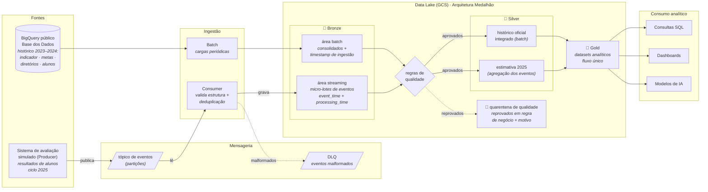

# Pipeline Híbrida para Análise da Alfabetização no Brasil

Pipeline híbrida de dados (batch e streaming) em nuvem para análise do **Indicador Criança Alfabetizada** (INEP / Base dos Dados), com Arquitetura Medalhão (Bronze, Silver e Gold), qualidade de dados, monitoramento e FinOps.

> Tech Challenge da Fase 2 (Data Prepare) · Pós-graduação IA para Devs · FIAP POS TECH

---

## Sumário

1. [Contexto do problema](#1-contexto-do-problema)
2. [Objetivo do projeto](#2-objetivo-do-projeto)
3. [Fonte de dados](#3-fonte-de-dados)
4. [Arquitetura da solução](#4-arquitetura-da-solução)
5. [Tecnologias utilizadas](#5-tecnologias-utilizadas) 🚧
6. [Decisões arquiteturais e trade-offs](#6-decisões-arquiteturais-e-trade-offs) 🚧
7. [Qualidade de dados](#7-qualidade-de-dados) 🚧
8. [Monitoramento](#8-monitoramento) 🚧
9. [FinOps e custos](#9-finops-e-custos) 🚧
10. [Aplicação em Inteligência Artificial](#10-aplicação-em-inteligência-artificial) 🚧
11. [Como executar](#11-como-executar) 🚧
12. [Estrutura do repositório](#12-estrutura-do-repositório)
13. [Status e roadmap](#13-status-e-roadmap)
14. [Referências](#14-referências)

🚧 = seção em construção, preenchida conforme a evolução do projeto (ver [Status e roadmap](#13-status-e-roadmap)).

---

## 1. Contexto do problema

A alfabetização na idade certa é um dos fundamentos do desenvolvimento educacional, social e econômico de um país. Crianças que não consolidam a leitura e a escrita no período adequado tendem a acumular defasagens ao longo de toda a trajetória escolar. Para enfrentar esse desafio, o Brasil instituiu o Compromisso Nacional Criança Alfabetizada, política que articula União, estados, Distrito Federal e municípios com o objetivo de garantir a alfabetização de todas as crianças até o final do 2º ano do ensino fundamental.

A relação entre educação e renda é bem documentada. Dados da PNAD Contínua com ano-base 2025 (IBGE, divulgação de 2026) indicam que trabalhadores com ensino superior completo recebem, em média, 3,6 vezes mais do que pessoas sem instrução. Estudo do Insper em parceria com a Fundação Roberto Marinho, publicado em 2020 e conduzido pelos economistas Ricardo Paes de Barros e Laura Machado, estimou em R$ 372 mil (valores de 2020) a perda total para o país por cada jovem que não conclui a educação básica, considerando renda, atividade econômica, saúde e violência ao longo da vida. Como mais de 500 mil jovens deixam de concluir a educação básica a cada ano, a perda estimada é de R$ 214 bilhões por coorte anual, o equivalente a cerca de 3% do PIB da época. No caso específico da alfabetização, relatório do Banco Mundial de 2022 estima que a geração de estudantes afetada pela pandemia pode deixar de obter US$ 21 trilhões em rendimentos ao longo da vida, em valor presente, em razão da chamada pobreza de aprendizagem, definida como a incapacidade de ler e compreender um texto simples aos 10 anos de idade.

Para acompanhar a política, foi criado o Indicador Criança Alfabetizada, que expressa o percentual de crianças do 2º ano consideradas alfabetizadas. A classificação de cada criança parte de avaliações aplicadas pelas redes estaduais de ensino, cujos resultados são equalizados pelo INEP na escala de proficiência do Saeb, o que permite a comparação entre estados e municípios. É considerada alfabetizada a criança que atinge ao menos 743 pontos nessa escala. Esse critério foi estabelecido pela Pesquisa Alfabetiza Brasil (INEP, 2023), na qual professores alfabetizadores de todo o país definiram as habilidades mínimas esperadas de uma criança alfabetizada, como ler e compreender textos curtos, localizar informações e escrever textos simples do cotidiano. Uma explicação detalhada do indicador e da sua metodologia está em [docs/sobre_o_indicador.md](docs/sobre_o_indicador.md).

Os resultados recentes mostram avanço. Na rede pública, a taxa passou de 55,9% em 2023 para 59,2% em 2024, valor 0,7 ponto percentual abaixo da meta pactuada para aquele ano (59,9%), e alcançou 66,0% em 2025, superando a meta de 64%. As metas pactuadas seguem em progressão até 80% em 2030 e convivem com a aspiração da política de alfabetizar a totalidade das crianças.

As médias nacionais, no entanto, encobrem desigualdades territoriais expressivas. Entre municípios e redes de ensino, as taxas de alfabetização variam de aproximadamente 2% a 100%. Compreender os fatores associados a essas diferenças exige a integração de dados que hoje se encontram em fontes distintas: o indicador por município e por UF, as metas pactuadas em cada esfera, os dados territoriais e os microdados de cerca de 4 milhões de alunos avaliados por ano. A qualidade e a atualização dessas informações condicionam a capacidade dos gestores públicos de priorizar ações e recursos.

## 2. Objetivo do projeto

O objetivo deste projeto é construir uma pipeline híbrida de dados em nuvem capaz de integrar, tratar e disponibilizar as fontes relacionadas ao Indicador Criança Alfabetizada, transformando dados públicos dispersos em uma base analítica única, confiável e auditável. A solução simula o trabalho de um time de engenharia de dados de uma organização pública de análise educacional, responsável por sustentar análises e decisões baseadas nesses dados.

A ingestão dos dados combina dois modos complementares. No modo batch, cargas periódicas trazem as bases consolidadas: o indicador por UF e por município, as metas pactuadas em cada esfera, os dados territoriais e os microdados de alunos. No modo streaming, eventos simulados reproduzem um cenário real do ciclo do indicador: a chegada de novas medições e atualizações de resultados, como as da edição de 2025, que ainda não constam nas bases públicas consolidadas. Essa combinação permite que a base analítica se mantenha atualizada sem depender exclusivamente de cargas completas.

A organização dos dados segue a Arquitetura Medalhão, em três camadas com níveis crescentes de refinamento. Na camada Bronze, os dados são preservados exatamente como chegam das fontes, garantindo histórico, auditoria e capacidade de reprocessamento. Na camada Silver, os dados são limpos, padronizados e validados, e as diferentes bases são integradas por meio de chaves comuns, como o código IBGE do município, a UF e o ano. Na camada Gold, os dados são modelados para consumo analítico, com visões como o indicador por município, a comparação entre metas e resultados e a evolução temporal da alfabetização.

Três disciplinas transversais sustentam a pipeline. Regras de qualidade de dados verificam duplicidades, valores ausentes, integridade das chaves de relacionamento e consistência entre tabelas, isolando registros inválidos em área de quarentena para auditoria. Mecanismos de monitoramento acompanham falhas de ingestão, latência e volume processado em cada camada. Práticas de FinOps orientam as escolhas de armazenamento, processamento e consulta, buscando o menor custo operacional possível em nuvem sem comprometer a escalabilidade.

Ao final, a camada analítica permite responder perguntas relevantes para a gestão educacional, como quais municípios estão mais distantes das metas pactuadas, onde o indicador evolui mais lentamente e como os resultados se distribuem entre redes de ensino e territórios. A mesma base fica preparada para usos futuros em inteligência artificial, como modelos de predição de risco de não alfabetização por município e a identificação de perfis de vulnerabilidade educacional, apoiando políticas públicas baseadas em evidências.

## 3. Fonte de dados

Os dados são disponibilizados pela plataforma [Base dos Dados](https://basedosdados.org/dataset/073a39d4-89cf-4068-b1e8-34ed0d9c0b72?table=e1de7a6a-5038-4e81-89f0-a15f2cc12c9b), no dataset **Avaliação da Alfabetização** (organização INEP), hospedado no BigQuery público `basedosdados.br_inep_avaliacao_alfabetizacao`.

| Tabela | Conteúdo | Linhas | Cobertura |
|---|---|---:|---|
| `uf` | Indicador por UF, série e rede | 145 | 2023–2024 |
| `municipio` | Indicador por município, série e rede | 23.995 | 2023–2024 |
| `meta_alfabetizacao_brasil` | Taxa observada e metas 2024–2030 (Brasil) | 3 | 2023–2025 |
| `meta_alfabetizacao_uf` | Taxa observada e metas 2024–2030 por UF | 81 | 2023–2025 |
| `meta_alfabetizacao_municipio` | Taxa observada e metas 2024–2030 por município | 10.704 | 2023–2024 |
| `br_inep_avaliacao_alfabetizacao__alunos` | Microdados por aluno avaliado | 3.867.999 | 2023–2024 |
| `dicionario` | Dicionário de códigos das colunas categóricas | 27 | — |

Antes de qualquer decisão de arquitetura, foi realizado um levantamento das fontes por meio do script [notebooks/levantamento_fontes_dados.py](notebooks/levantamento_fontes_dados.py), que investiga schemas, volumes, cobertura temporal, chaves de relacionamento e integridade das tabelas. Não se trata de uma análise exploratória dos dados (EDA), mas de um trabalho de reconhecimento das fontes cujo objetivo é amparar as decisões sobre a arquitetura da solução e as tecnologias utilizadas, registradas em [docs/decisoes.md](docs/decisoes.md). Os resultados completos do levantamento estão documentados em [docs/dicionario_dados.md](docs/dicionario_dados.md).

## 4. Arquitetura da solução

### 4.1 Classificação das fontes: batch e streaming

A definição do modo de ingestão de cada fonte parte de um critério simples: a dinâmica natural de produção do dado. Fontes cadastrais e pactuadas mudam raramente e são publicadas de forma consolidada; já os resultados de avaliação nascem de forma contínua, à medida que as provas são aplicadas e processadas pelas redes estaduais.

| Fonte | Natureza | Dinâmica de produção | Modo de ingestão |
|---|---|---|---|
| Diretório de municípios (IBGE) | Cadastro | Quase imutável | Batch |
| Metas de alfabetização (Brasil, UF, município) | Pacto entre entes federativos | Definidas uma vez, revisões raras | Batch |
| Indicador consolidado (`uf`, `municipio`) | Dado derivado (agregação) | Publicado uma vez ao ano | Batch (carga histórica) |
| Microdados de alunos | Fonte primária | Cada avaliação processada gera um resultado novo | Streaming (simulado) |

A relação entre as tabelas consolidadas e os microdados foi verificada empiricamente durante o levantamento das fontes. Recalculando a taxa municipal a partir dos alunos, com o peso amostral, 95,8% das combinações de município, ano e rede coincidem com o valor oficial em até 0,05 ponto percentual, o que indica que essas tabelas se comportam majoritariamente como agregações dos microdados. A relação, porém, não é completa: em 2023, 643 municípios constam no consolidado sem nenhum registro correspondente nos microdados públicos, além de divergências residuais de valor em cerca de 4% dos casos. Isso mostra que o cálculo oficial do INEP parte de uma base própria, mais completa que a disponibilizada publicamente (detalhes em [docs/sobre_o_indicador.md](docs/sobre_o_indicador.md)).

Por esse motivo, a pipeline utiliza sempre o dado da fonte oficial nas visões consolidadas: o histórico do indicador, ingerido por batch, permanece exatamente como publicado pelo INEP, sem substituição por valores derivados. A agregação calculada a partir dos eventos de alunos existe apenas onde ainda não há dado oficial, como visão preliminar do ciclo de 2025, claramente identificada como estimativa e destinada a ser substituída pelos valores oficiais quando publicados. A possibilidade de derivar as agregações diretamente dos microdados, dispensando parte das ingestões consolidadas, fica registrada como discussão futura de potencial economia no [diário de decisões](docs/decisoes.md). Ingerir as demais fontes por streaming adicionaria complexidade e custo sem benefício, uma vez que sua atualização é, por natureza, esporádica e consolidada.

### 4.2 Organização em camadas: código no repositório, dados no data lake

O repositório versiona exclusivamente código e documentação. Os dados residem em um data lake no Google Cloud Storage, organizado segundo a Arquitetura Medalhão:

```
gs://<bucket-do-projeto>/
├── bronze/            # dados brutos, como chegaram das fontes
│   ├── uf/  municipio/  metas_*/  alunos/     (cargas batch)
│   └── eventos_medicao/                       (micro-lotes do streaming)
├── silver/            # dados limpos, padronizados e integrados
├── gold/              # datasets analíticos prontos para consumo
└── quarantine/        # registros reprovados nas validações, com o motivo
```

Cada módulo de `src/` escreve em uma camada: `src/ingestion` alimenta a Bronze, `src/transform` produz Silver e Gold e `src/quality` alimenta a quarentena e os relatórios de validação. Os arquivos são gravados em formato Parquet, colunar e comprimido, com particionamento por data de ingestão na Bronze e por ano nas demais camadas, o que reduz armazenamento e custo de leitura.

### 4.3 Fluxo de dados

1. **Ingestão batch:** consultas ao BigQuery público da Base dos Dados extraem as fontes consolidadas e as gravam na camada Bronze, com metadados de ingestão (timestamp e origem). O papel do batch não se limita ao histórico de 2023 e 2024: toda publicação consolidada futura, como o resultado oficial de 2025 quando divulgado pelo INEP, entra pela mesma carga;
2. **Ingestão streaming:** um producer, que representa o sistema externo de avaliação, publica no tópico os resultados individuais do ciclo de 2025; o producer não conhece o destino dos eventos. Um consumer, componente da pipeline, lê o tópico, valida a estrutura dos eventos, descarta duplicatas e grava micro-lotes na Bronze. Eventos estruturalmente inválidos (campo ausente, tipo errado) são desviados pelo consumer para uma Dead Letter Queue (DLQ), sem bloquear o fluxo. A DLQ não se confunde com a quarentena de qualidade: a DLQ recebe o que não pôde ser lido, na ingestão; a quarentena recebe o que foi lido mas reprovou em regra de negócio, na transformação. Essa separação de papéis é o desacoplamento característico do padrão publish/subscribe;
3. **Transformação:** os dados da Bronze são limpos, padronizados e integrados na Silver; os eventos de alunos são agregados para compor a estimativa preliminar do indicador de 2025;
4. **Qualidade:** as regras de validação são executadas na passagem para a Silver; registros reprovados são isolados na quarentena com o motivo da reprovação;
5. **Consumo analítico:** a camada Gold materializa os datasets analíticos, publicados para consulta SQL, dashboards e modelos.

Os dois modos de ingestão compartilham as mesmas camadas do medalhão: batch e streaming gravam em áreas distintas da mesma Bronze e convergem na Silver, onde o histórico consolidado e a estimativa do ciclo corrente são integrados. Da Silver em diante, o fluxo é único.

### 4.4 Diagrama da pipeline



O diagrama representa a **visão de componentes** da pipeline: quais peças existem e como se conectam. Ele não especifica o conteúdo que trafega em cada conexão. Duas evoluções previstas completarão essa lacuna: os nomes dos serviços de mensageria e de processamento serão adicionados quando essas escolhas forem tomadas, e a **visão do fluxo do dado** (o payload dos eventos, seus campos e transformações a cada passo) será documentada na etapa de streaming, quando o contrato do evento for definido. Ambas constam na tabela de decisões pendentes do [diário de decisões](docs/decisoes.md).

### 4.5 Componentes e serviços

🚧 Em definição. Depende das decisões pendentes de mensageria do streaming e de motor de processamento, registradas no [diário de decisões](docs/decisoes.md).

## 5. Tecnologias utilizadas

🚧 Em definição. Escolhas já realizadas:

| Tecnologia | Papel | Justificativa |
|---|---|---|
| Google Cloud Platform (GCP) | Nuvem do projeto | A fonte de dados é distribuída via BigQuery público da Base dos Dados, o que elimina movimentação inicial de dados; o free tier cobre o volume do projeto |
| BigQuery | Fonte de extração e camada de consulta | Acesso SQL direto às tabelas públicas; consultas dentro do free tier de 1 TB/mês |
| Python | Linguagem da pipeline | Ecossistema consolidado de engenharia de dados; bibliotecas `pandas-gbq` e `google-cloud-bigquery` |

As demais escolhas (mensageria de streaming, processamento, orquestração) serão definidas e justificadas na Etapa 2.

## 6. Decisões arquiteturais e trade-offs

🚧 Em construção. Documentará as decisões de batch vs streaming, data lake vs data warehouse e custo vs performance.

## 7. Qualidade de dados

🚧 Em construção (Etapa 5). Implementará validações de duplicidade, valores ausentes, chaves de relacionamento e consistência entre tabelas, com área de quarentena para registros inválidos.

## 8. Monitoramento

🚧 Em construção (Etapa 7).

## 9. FinOps e custos

🚧 Em construção (Etapa 8). Incluirá estimativa de custo da arquitetura em dois cenários de volume.

## 10. Aplicação em Inteligência Artificial

🚧 Em construção (Etapa 9).

## 11. Como executar

🚧 Em construção. Evolui a cada etapa do projeto.

## 12. Estrutura do repositório

```
├── src/
│   ├── ingestion/     # ingestão batch e streaming (Etapas 3 e 4)
│   ├── transform/     # transformações bronze → silver → gold (Etapas 5 e 6)
│   └── quality/       # regras de validação e quarentena (Etapa 5)
├── docs/              # documentação técnica e de negócio
│   ├── dicionario_dados.md
│   └── sobre_o_indicador.md
├── notebooks/         # levantamentos e estudos (não fazem parte da pipeline)
│   └── levantamento_fontes_dados.py
└── config/            # parâmetros e schemas (sem credenciais)
```

## 13. Status e roadmap

| Etapa | Descrição | Status |
|---|---|---|
| 0 | Fundação: repositório, estrutura, README inicial | ✅ concluída |
| 1 | Exploração dos dados e dicionário | ✅ concluída |
| 2 | Desenho da arquitetura, diagrama e trade-offs | 🟡 em andamento |
| 3 | Ingestão batch (camada Bronze) | ⬜ |
| 4 | Ingestão streaming simulada (camada Bronze) | ⬜ |
| 5 | Camada Silver e qualidade de dados | ⬜ |
| 6 | Camada Gold (datasets analíticos) | ⬜ |
| 7 | Orquestração e monitoramento | ⬜ |
| 8 | FinOps e estimativa de custos | ⬜ |
| 9 | Documentação final | ⬜ |
| 10 | Vídeo executivo | ⬜ |

## 14. Referências

- INEP. [Avaliação da Alfabetização](https://www.gov.br/inep/pt-br/areas-de-atuacao/avaliacao-e-exames-educacionais/avaliacao-da-alfabetizacao). Acesso em jul. 2026.
- INEP. [Brasil e 20 unidades da Federação alcançam meta de alfabetização](https://www.gov.br/inep/pt-br/centrais-de-conteudo/noticias/avaliacao-da-alfabetizacao/brasil-e-20-unidades-da-federacao-alcancam-meta-de-alfabetizacao). Mar. 2026.
- IBGE. [PNAD Contínua: rendimento de todas as fontes, ano-base 2025](https://agenciadenoticias.ibge.gov.br/agencia-noticias/2012-agencia-de-noticias/noticias/46579-rendimento-medio-da-populacao-brasileira-atinge-r-3-367-em-2025). 2026.
- INSPER; FUNDAÇÃO ROBERTO MARINHO. [Consequências da Violação do Direito à Educação](https://www.insper.edu.br/wp-content/uploads/2021/05/Conseque%CC%82ncias-da-Violac%CC%A7a%CC%83o-do-Direito-a%CC%80-Educac%CC%A7a%CC%83o.pdf). Ricardo Paes de Barros; Laura Machado. 2020.
- BANCO MUNDIAL. [The State of Global Learning Poverty: 2022 Update](https://www.worldbank.org/pt/news/press-release/2022/06/23/70-of-10-year-olds-now-in-learning-poverty-unable-to-read-and-understand-a-simple-text). 2022.
- BASE DOS DADOS. [Dataset Avaliação da Alfabetização](https://basedosdados.org/dataset/073a39d4-89cf-4068-b1e8-34ed0d9c0b72?table=e1de7a6a-5038-4e81-89f0-a15f2cc12c9b). Acesso em jul. 2026.

---

Desenvolvido por Pedro Henrique Martinez Bertolo (RM373453) · Tech Challenge Fase 2 · FIAP POS TECH
